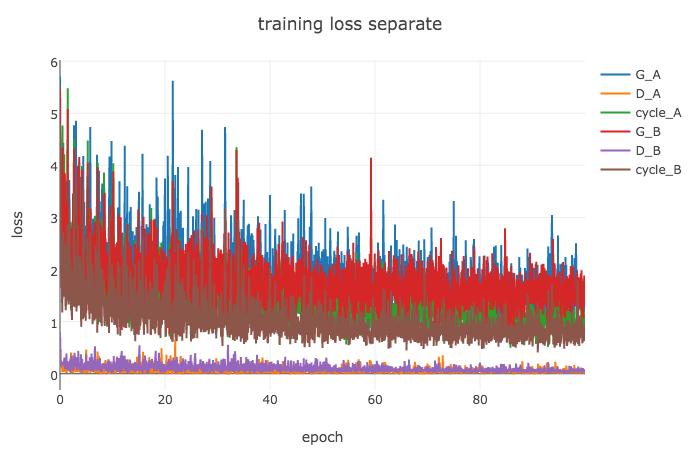
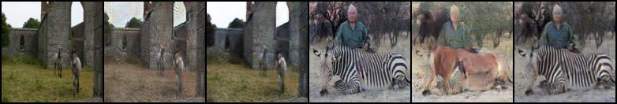
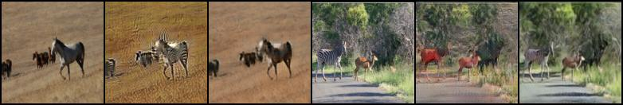
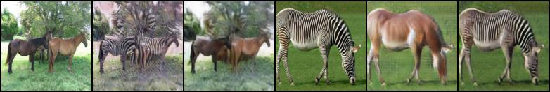
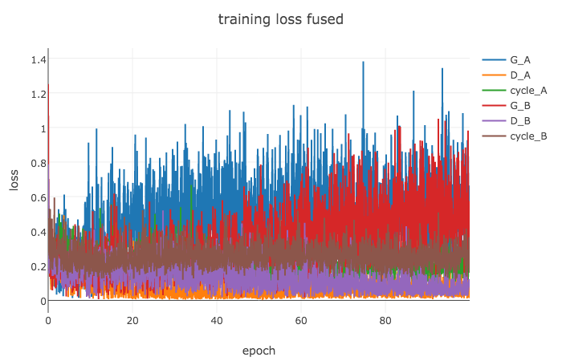
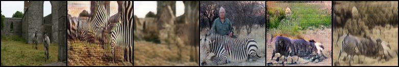
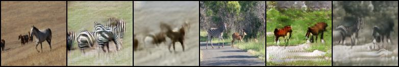
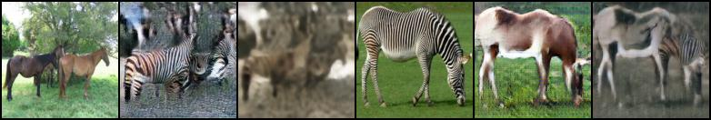

# Reimplementation of CycleGAN model in pytorch:
[[paper]](https://arxiv.org/pdf/1703.10593.pdf) [[authors implementation(torch)]](https://github.com/junyanz/CycleGAN)

Learning image-to-image translation without input-output pairs.

### Horse -> Zebra 

###Separate updates of A and B generatos

###Fused updates of A and B generators 

